# Box5 - Blackpearl VM Penetration Testing Walkthrough Training
1. Network Scanning
- Scan network to get target IP Address\

- Scan target IP Address\
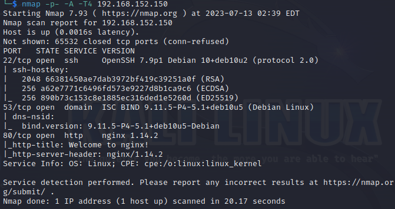\
Result:
- 22(ssh) -> OpenSSH 7.9p1 Debian 10+deb10u2 (protocol 2.0)
- 53(domain) -> ISC BIND 9.11.5-P4-5.1+deb10u5 (Debian Linux)
- 80(http) -> nginx/1.14.2

Information Acquired:
- Open SSH port, can be used once we get any potential credential
- Open port 53 with a clear version of it
- Open HTTP port, may contain some information that can be used from the available page\
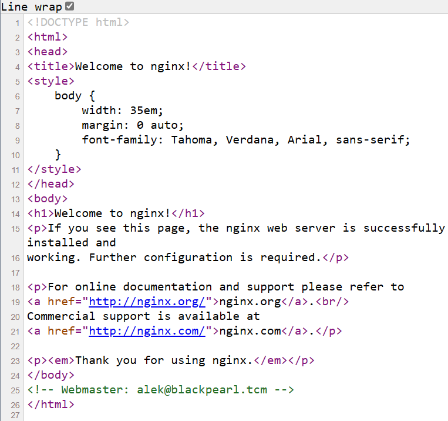\
Acquired: `webmaster: alek@blackpearl.tcm` -> maybe can be used for ssh connection?

2. Directory Busting
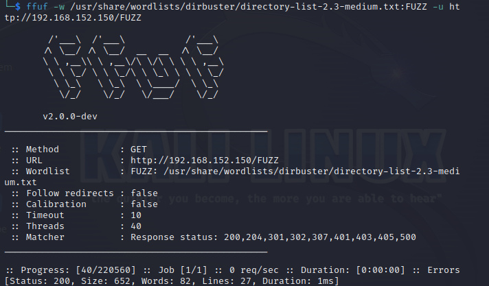\
Result:
- secret(status 200)\
\
_Self note: Seems like we are tricked. But one thing for sure, we can confirm that Alek is one of the user that we can use to access the SSH I guess?_

3. Trying from DNS port
- Looking for the DNS that is running on the target machine with `dnsrecon`\

- Add the dns to our `etc/hosts`

- Try to open the website again using the DNS name
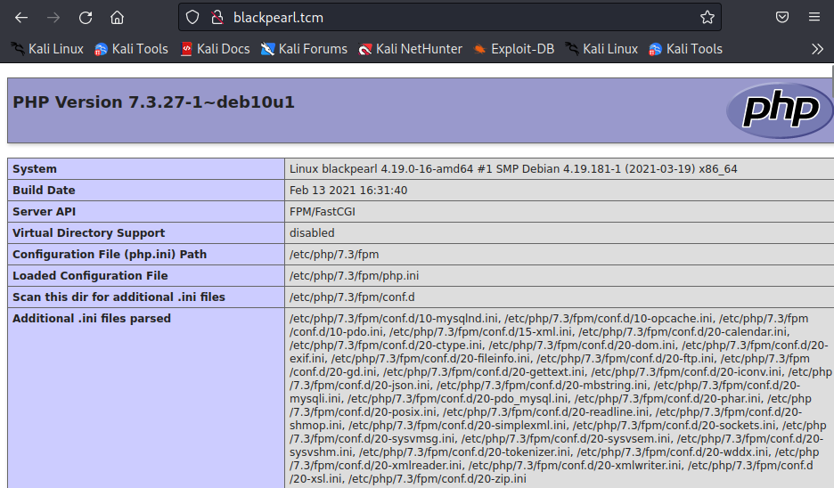

4. Directory busting against the website again using the DNS
\
Result:
- navigate(status 301)\
\
_Self note: Seems like there is a login page here. Also, we get information of the CMS version used._

4. Look for vulnerabilities of that CMS
- Searchsploit result

- [Navigate CMS Unauthenticated RCE](https://www.rapid7.com/db/modules/exploit/multi/http/navigate_cms_rce/)
- [Navigate CMS Unauthenticated RCE with Metasploit](https://www.exploit-db.com/exploits/45561)

5. Try out the vulnerability with metasploit
- Set the options of the tool correctly\

- Check if the option set is correct or not\

- Run the metasploit tool\

- Jump to the shell\


6. Generating TTY Shell
- [TTY Shell Spawn Script](https://wiki.zacheller.dev/pentest/privilege-escalation/spawning-a-tty-shell)
```
python -c 'import pty; pty.spawn("/bin/sh")'

echo os.system('/bin/bash')

/bin/sh -i

perl —e 'exec "/bin/sh";'

perl: exec "/bin/sh";

ruby: exec "/bin/sh"

lua: os.execute('/bin/sh')

(From within IRB)
exec "/bin/sh"

(From within vi)
:!bash

(From within vi)
:set shell=/bin/bash:shell

(From within nmap)
!sh

# From netsec.ws
```
- Check if target victim has python

- Run the code
```
python -c 'import pty; pty.spawn("/bin/bash")'
```


7. Getting ready with privilege escalation
- Check if the current user has super user privilege

- Prepare the folder from attacker machine to host a folder to share linpeas

- In the victim machine, move to `/tmp` folder and download the linpeas
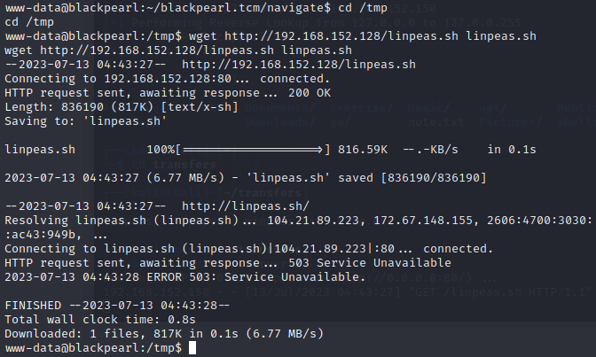
- Make the linpeas executable
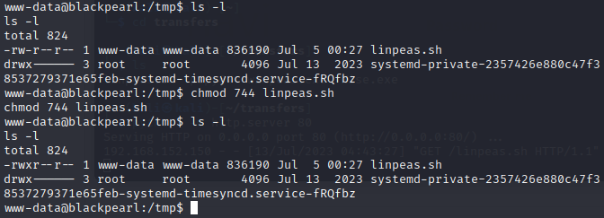
- Run linpeas


8. Important information from linpeas\
Look for something that is **abusable**
- Backup file:
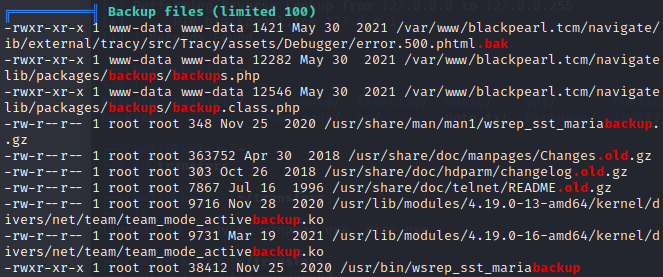
- Files with capabilities:

- Interesting file with unknown SUID:
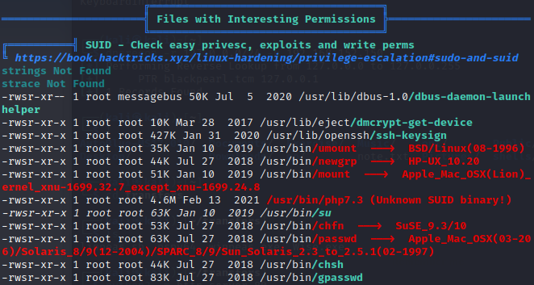
```
-rwsr-xr-x

The 's' (sticky bit) means that the user can run that file as the owner of that file.
For example, if the 's' is in the position of execute from Owner permission then any other user can run it as a root

-rwx-r-s-r-x

In the second example, the 's' is in the position of execute from Group permission. Means that we can run it as if we are part of the Group.
```
- Look for permission settings with SUID because having SUID doesn't mean it's vulnerable
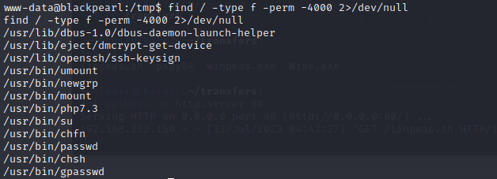
```
find / -type f -perm -4000 2>/dev/null
```

9. Get script to exploit the vulnerability
- With `GTFOBins`, look for script that can be run on one of the path from permission setting above. Only 1 available, which is `php`
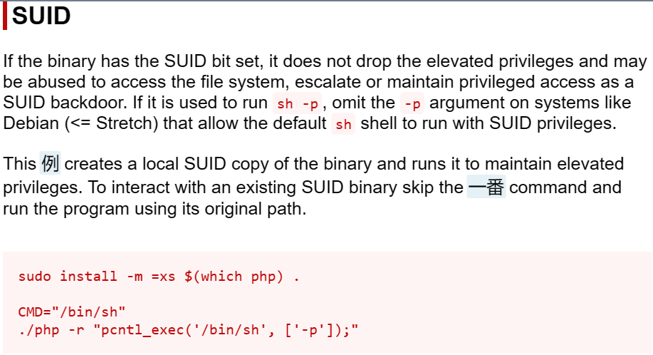
- Run the script
```
/usr/bin/php7.3 -r "pcntl_exec('/bin/sh', ['-p']);"

the /usr/bin/php7.3 can be customized based on the machine path
```
\
With this, we are able to get root privilege while staying as `www-data` user\
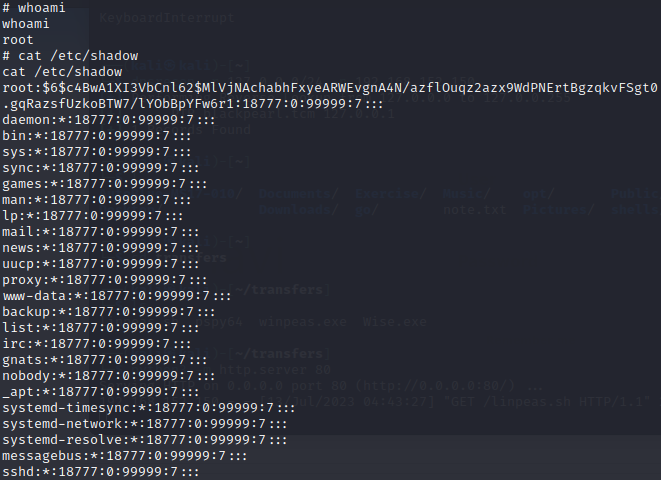\

10. Get the flag

